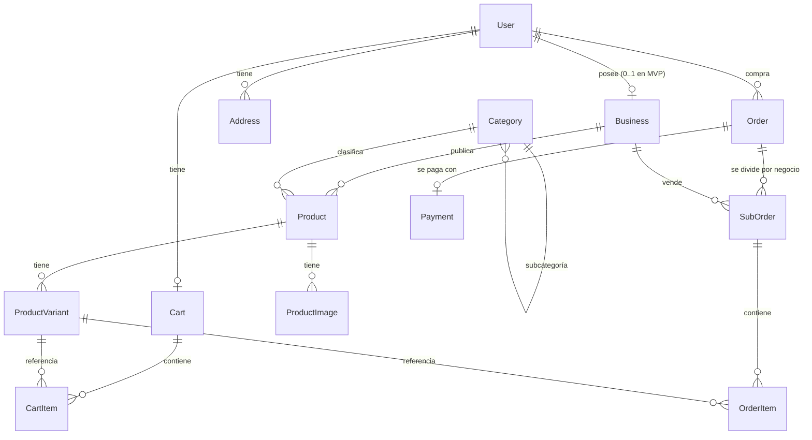

# Marketplace — Documento de Diseño

> Webapp tipo MercadoLibre con soporte de **negocios** (tiendas multi-vendedor).
> Objetivo: producto real, orientado a producción.
> Arquitectura: frontend y backend separados.
> Estado: borrador v1 — 2026-06-10.

---

## 1. Visión y alcance

Un marketplace donde cualquier usuario puede comprar, y además puede crear un
**negocio** (tienda) para publicar y vender productos. La compra puede incluir
productos de varios negocios a la vez.

### Alcance del MVP (fase 1)

- Registro / login (email + Google).
- Crear y administrar un negocio (perfil, logo, descripción).
- Publicar productos con variantes, imágenes, stock y categoría.
- Home con productos destacados, búsqueda con filtros (texto, categoría, precio).
- Página de producto y página de negocio.
- Carrito multi-negocio → checkout → pago con MercadoPago (Checkout Pro).
- Órdenes con estados, vista "mis compras" y "ventas de mi negocio".
- Emails transaccionales básicos (confirmación de compra, nueva venta).

### Fuera del MVP (fases siguientes)

- Reseñas y reputación (fase 2).
- Mensajería comprador-vendedor (fase 2).
- Integración de envíos / cálculo de costos (fase 3).
- Panel de administración de la plataforma (fase 3).
- App móvil (la API REST ya lo deja preparado).

---

## 2. Arquitectura

```
┌─────────────────┐      HTTPS/JSON      ┌──────────────────┐
│  Frontend        │ ───────────────────▶ │  API Backend      │
│  Next.js 15      │ ◀─────────────────── │  NestJS           │
│  (Vercel)        │                      │  (Railway/Fly.io) │
└─────────────────┘                      └────────┬─────────┘
                                                   │ Prisma
        Cloudinary ◀── subida de imágenes          ▼
        MercadoPago ◀─ pagos + webhooks      PostgreSQL (Neon)
        Resend     ◀── emails                Redis (cache/colas, fase 2)
```

### Decisiones

| Capa | Elección | Por qué |
|------|----------|---------|
| Frontend | **Next.js 15 + TypeScript** (solo como frontend, App Router) | Un marketplace vive del SEO: las páginas de producto y búsqueda necesitan SSR. Next como cliente de la API lo resuelve sin acoplar el backend. |
| UI | Tailwind CSS + shadcn/ui | Velocidad y consistencia visual. |
| Backend | **NestJS + TypeScript** | Estructura modular (un módulo por dominio), validación con DTOs, buen soporte de testing. API REST versionada (`/api/v1`). |
| ORM / DB | **Prisma + PostgreSQL** | Modelo fuertemente relacional (órdenes, stock). Postgres full-text cubre la búsqueda del MVP. |
| Auth | JWT (access + refresh) emitidos por la API; Google OAuth | Al estar separados FE/BE, la API es dueña de la identidad. Cookies httpOnly para el web. |
| Pagos | **MercadoPago Checkout Pro** + webhook de confirmación | Estándar en LatAm; Checkout Pro evita manejar tarjetas (PCI). |
| Imágenes | Cloudinary (upload firmado desde el front) | CDN + transformaciones de imagen incluidas. |
| Emails | Resend | Simple y barato para transaccionales. |
| Monorepo | pnpm workspaces (`apps/web`, `apps/api`, `packages/shared`) | Tipos compartidos (DTOs, enums) entre front y back. |
| Búsqueda futura | Meilisearch | Solo cuando el full-text de Postgres quede corto. |

---

## 3. Modelo de datos

### Diagrama (entidades principales)



### Entidades

**User**
- `id` (uuid), `email` (único), `passwordHash` (null si solo OAuth), `name`,
  `phone?`, `avatarUrl?`, `emailVerifiedAt?`, `createdAt`.
- Un usuario siempre puede comprar. Vender requiere tener un `Business`.

**Business** (el corazón del diseño)
- `id`, `ownerId` → User, `name`, `slug` (único, para URL `/tienda/{slug}`),
  `description`, `logoUrl?`, `bannerUrl?`, `status` (`PENDING | ACTIVE | SUSPENDED`),
  `createdAt`.
- MVP: 1 negocio por usuario (constraint único en `ownerId`). El modelo permite
  relajarlo después sin migración dolorosa.

**Category**
- `id`, `parentId?` (árbol), `name`, `slug`. Árbol de 2 niveles en el MVP.

**Product**
- `id`, `businessId`, `categoryId`, `title`, `slug`, `description` (markdown),
  `status` (`DRAFT | ACTIVE | PAUSED | DELETED`), `createdAt`, `updatedAt`.
- Columna generada `searchVector` (tsvector sobre `title + description`) con
  índice GIN para búsqueda full-text.

**ProductVariant**
- `id`, `productId`, `sku?`, `attributes` (jsonb: `{"color":"rojo","talle":"M"}`),
  `priceCents` (int — **nunca floats para dinero**), `currency` (`ARS` por ahora),
  `stock` (int), `isDefault`.
- Todo producto tiene al menos una variante (la default), así el carrito y las
  órdenes siempre apuntan a variantes y no hay dos caminos de código.

**ProductImage**
- `id`, `productId`, `url`, `position`.

**Cart / CartItem**
- Cart: `id`, `userId` (único). CartItem: `id`, `cartId`, `variantId`, `quantity`.
- Carrito anónimo (pre-login) vive en localStorage del front y se fusiona al loguear.

**Order** (una por checkout)
- `id`, `buyerId`, `status` (`PENDING_PAYMENT | PAID | CANCELLED | REFUNDED`),
  `totalCents`, `currency`, `shippingAddress` (jsonb snapshot), `createdAt`.

**SubOrder** (una por negocio dentro de la orden — así lo modela ML)
- `id`, `orderId`, `businessId`, `status`
  (`PENDING | CONFIRMED | SHIPPED | DELIVERED | CANCELLED`), `subtotalCents`.
- El vendedor solo ve y gestiona sus SubOrders.

**OrderItem**
- `id`, `subOrderId`, `variantId`, `quantity`, `unitPriceCents`,
  `titleSnapshot`, `attributesSnapshot` (jsonb).
- **Snapshot de precio y título al momento de compra**: si el vendedor edita el
  producto después, la orden no cambia.

**Payment**
- `id`, `orderId`, `provider` (`MERCADOPAGO`), `providerPaymentId`,
  `status` (`PENDING | APPROVED | REJECTED | REFUNDED`), `amountCents`,
  `rawWebhookPayload` (jsonb), `createdAt`.

**Address**
- `id`, `userId`, `street`, `number`, `city`, `province`, `zipCode`, `isDefault`.

### Reglas de negocio críticas

1. **Stock**: se descuenta al confirmarse el pago (webhook `APPROVED`), con
   `UPDATE ... SET stock = stock - qty WHERE stock >= qty` dentro de una
   transacción. Si falla por falta de stock → refund automático y orden cancelada.
   (Alternativa con reserva al iniciar checkout: fase 2.)
2. **Dinero siempre en centavos (int)** y la moneda explícita en cada registro.
3. **Idempotencia del webhook**: MercadoPago reintenta; el handler debe ser
   idempotente por `providerPaymentId`.
4. Borrado de productos es **soft delete** (`status = DELETED`) porque las
   órdenes históricas los referencian vía snapshot.

---

## 4. API (REST, `/api/v1`)

### Auth
- `POST /auth/register` · `POST /auth/login` · `POST /auth/refresh` · `POST /auth/logout`
- `GET /auth/google` → callback OAuth
- `GET /me` · `PATCH /me`

### Negocios
- `POST /businesses` (crear mi negocio) · `GET /businesses/:slug` (público)
- `PATCH /businesses/me` · `GET /businesses/me/dashboard` (métricas básicas)

### Catálogo
- `GET /categories`
- `POST /products` · `PATCH /products/:id` · `DELETE /products/:id` (dueño)
- `GET /products/:slug` (público, incluye variantes e imágenes)
- `GET /search?q=&category=&minPrice=&maxPrice=&sort=&page=` (público)
- `POST /uploads/sign` (firma para subir a Cloudinary)

### Carrito y compra
- `GET /cart` · `POST /cart/items` · `PATCH /cart/items/:id` · `DELETE /cart/items/:id`
- `POST /checkout` → valida stock/precios, crea Order + SubOrders + preferencia
  de MercadoPago, devuelve `init_point` (URL de pago).
- `POST /webhooks/mercadopago` (confirma pago, descuenta stock, dispara emails)
- `GET /orders` (mis compras) · `GET /orders/:id`
- `GET /businesses/me/suborders` (mis ventas) · `PATCH /suborders/:id/status`

Convenciones: paginación por cursor en listados públicos, errores
`{ code, message, details }`, rate limiting en auth y checkout.

---

## 5. Pantallas (frontend)

### Público (SSR, indexable)
| Ruta | Pantalla |
|------|----------|
| `/` | Home: buscador, categorías, productos destacados/recientes |
| `/buscar?q=` | Resultados con filtros laterales (categoría, precio) y orden |
| `/p/{slug}` | Detalle de producto: galería, selector de variantes, precio, stock, card del negocio, botón comprar/agregar |
| `/tienda/{slug}` | Página del negocio: banner, descripción, su catálogo |
| `/c/{slug}` | Listado por categoría |

### Comprador (autenticado)
| Ruta | Pantalla |
|------|----------|
| `/carrito` | Carrito agrupado por negocio, subtotales |
| `/checkout` | Dirección + resumen → redirige a MercadoPago |
| `/checkout/resultado` | Éxito / pendiente / rechazo (vuelta de MP) |
| `/compras` y `/compras/{id}` | Historial y detalle con estados por sub-orden |
| `/perfil` | Datos, direcciones |

### Vendedor (`/vender/*`, requiere negocio)
| Ruta | Pantalla |
|------|----------|
| `/vender` | Onboarding: crear el negocio |
| `/vender/dashboard` | Ventas recientes, productos activos, métricas simples |
| `/vender/productos` (+ `/nuevo`, `/{id}/editar`) | CRUD con variantes e imágenes |
| `/vender/ventas` | Sub-órdenes con cambio de estado (confirmar → enviar → entregar) |
| `/vender/negocio` | Editar perfil de la tienda |

---

## 6. Roadmap

- **Fase 0 — Fundaciones (1ª semana):** monorepo, NestJS + Prisma + Postgres,
  Next.js conectado, auth completa, CI básico (lint + test + build).
- **Fase 1 — MVP vendible:** negocios, productos, búsqueda, carrito, checkout
  con MercadoPago en sandbox, órdenes, emails. → *Demo end-to-end.*
- **Fase 2 — Confianza:** reseñas/reputación, mensajería, mejores métricas de
  vendedor, reserva de stock en checkout.
- **Fase 3 — Operación:** panel admin (moderación de negocios/productos),
  envíos, Meilisearch si la búsqueda lo pide.

### Riesgos a vigilar

- **Split de pagos a vendedores:** MVP cobra todo a la cuenta de la plataforma y
  liquida manualmente. El split automático (MP marketplace / Connect) es un
  proyecto en sí mismo — decidir en fase 2/3.
- **Carga de impuestos/facturación (AFIP/ARCA)** si opera en Argentina: fuera del
  MVP, pero condiciona cómo se registran las ventas.
- **Moderación de contenido** de publicaciones: mínimo un flag de reporte en fase 2.
